## WEB APPLICATION DEVELOPMENT - LAB 08 ASSIGNMENT

### NGUYEN VIET THAO - ITCSIU23058

### EXERCISE 5: SEARCH & FILTER ENDPOINTS

- Task 5.1: Search Customers

Test: 
```
GET /api/customers/search?keyword={keyword}
```


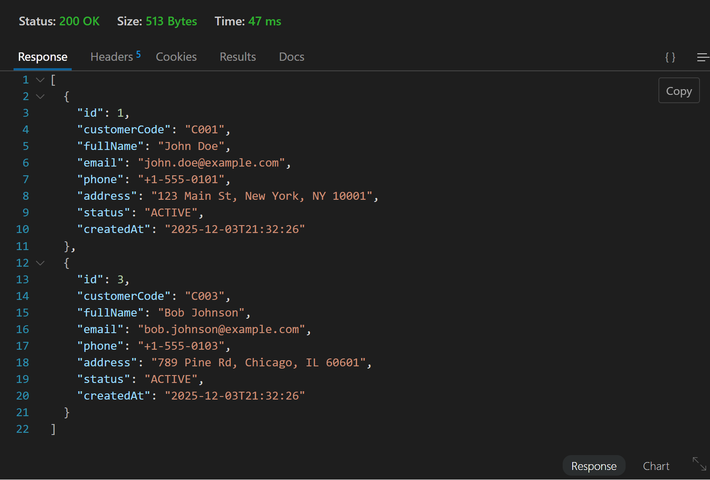

- Task 5.2: Filter by Status

Test: 
```
GET /api/customers/status/ACTIVE 
```
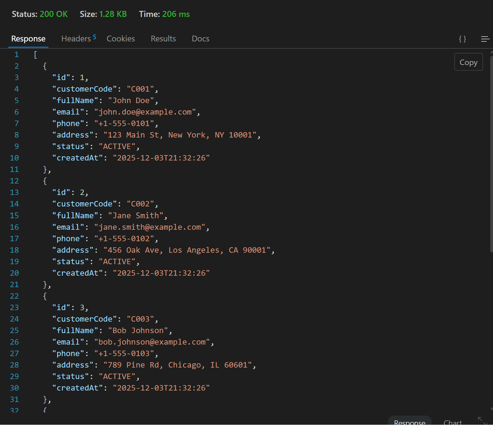

```
GET /api/customers/status/INACTIVE
```
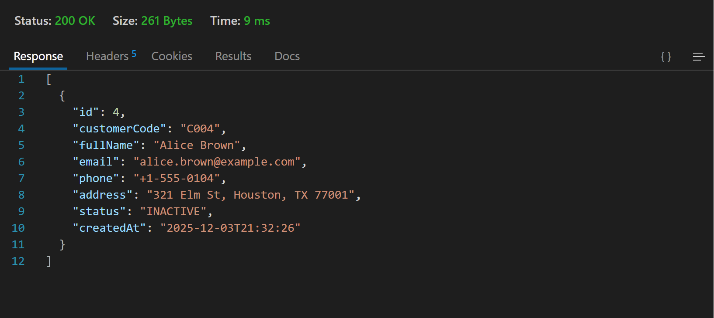


- Task 5.3: Advanced Search 
Test: 
```
GET /api/customers/advanced-search?name=john
```

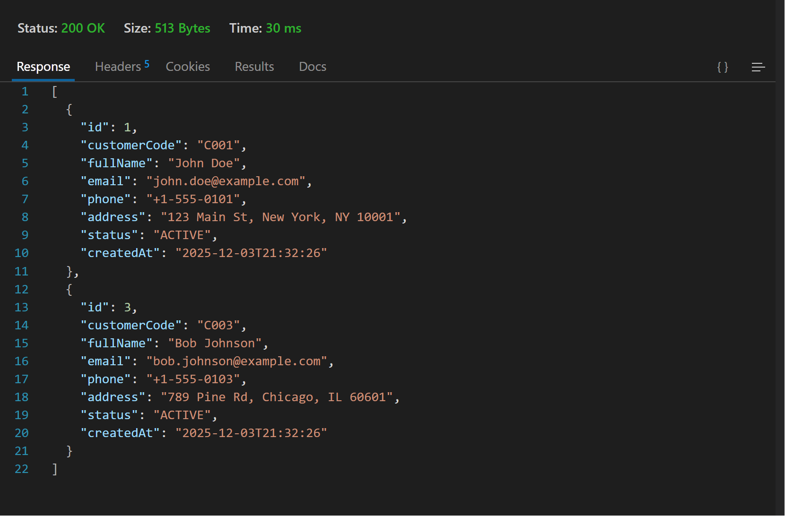

### EXERCISE 6: PAGINATION & SORTING

- Task 6.1: Add Pagination

Test :
```
GET /api/customers?page=0&size=5

GET /api/customers?page=1&size=10
```
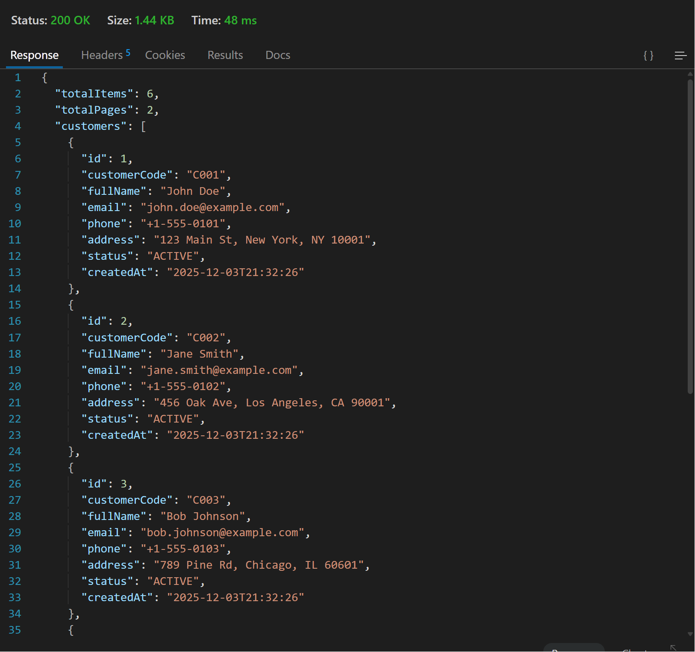

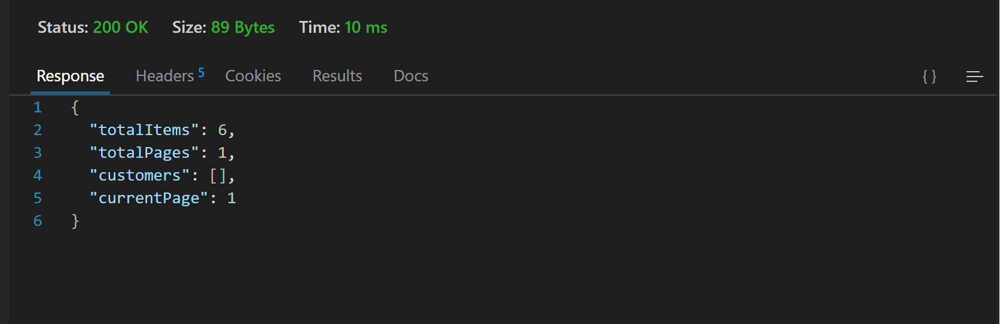


- Task 6.2: Add Sorting
Test :
```
GET /api/customers?page=0&size=5&sortBy=fullName&sortDir=asc

GET /api/customers?page=0&size=5&sortBy=customerCode&sortDir=desc
```
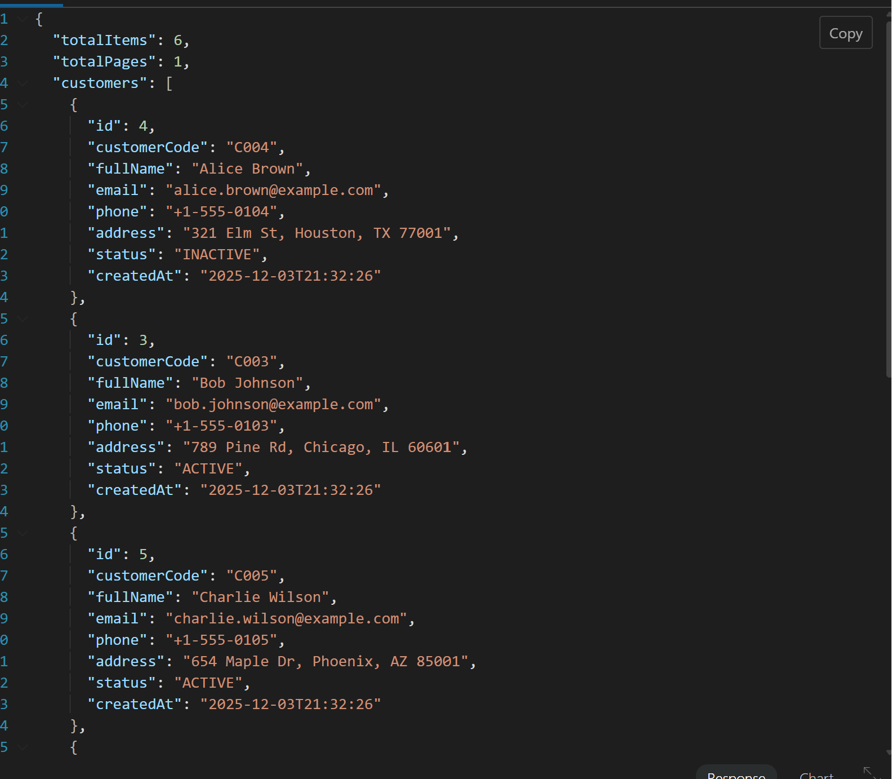

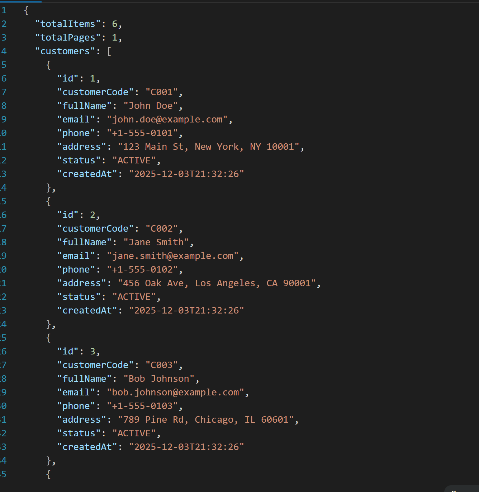


### EXERCISE 7: PARTIAL UPDATE WITH PATCH

- Task 7.1: Create Update DTO

- Task 7.2: Implement PATCH Endpoint

- Task 7.3: Test PATCH vs PUT

Test:
```
PUT /api/customers/1
{
    "customerCode": "C001",
    "fullName": "John Updated",
    "email": "john.updated@example.com",
    "phone": "+1-555-9999",
    "address": "New Address"
}

PATCH /api/customers/1
{
    "fullName": "John Partially Updated"
}
```
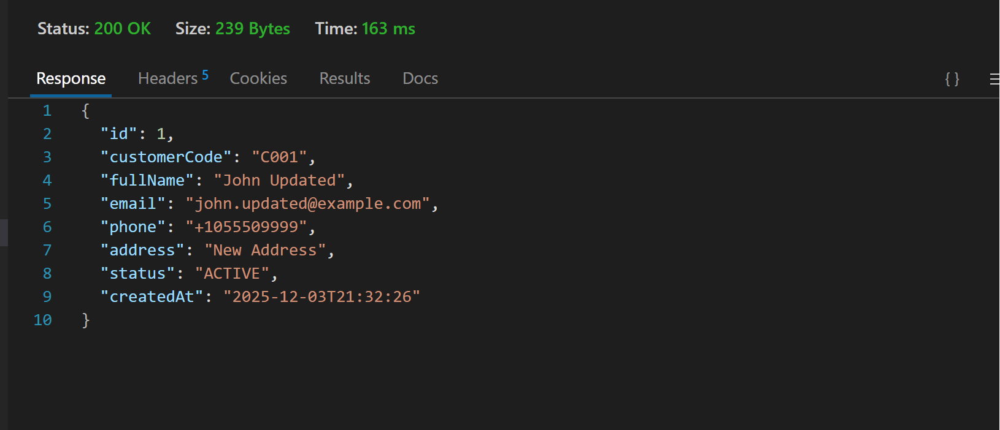

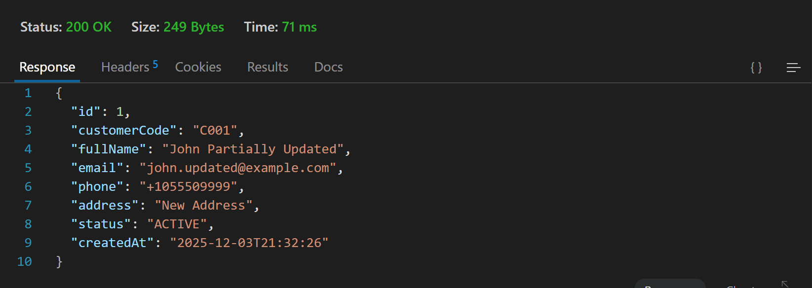

### EXERCISE 8: API DOCUMENTATION

- Task 8.1: Create Postman Collection

- Task 8.2: Document API Responses

```
# Customer API Documentation

## Base URL
`http://localhost:8080/api/customers`

## Endpoints

### 1. Get All Customers
**GET** `/api/customers`

**Response:** 200 OK
```json
[
    {
        "id": 1,
        "customerCode": "C001",
        ...
    }
]
```

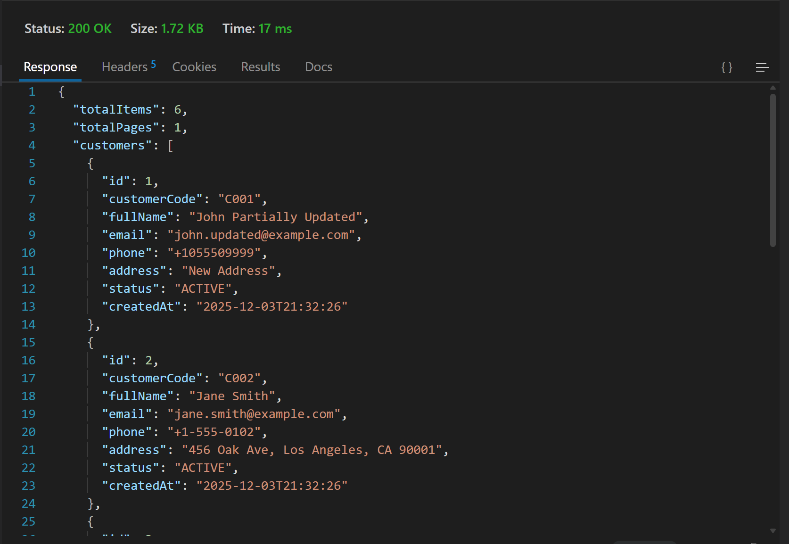
