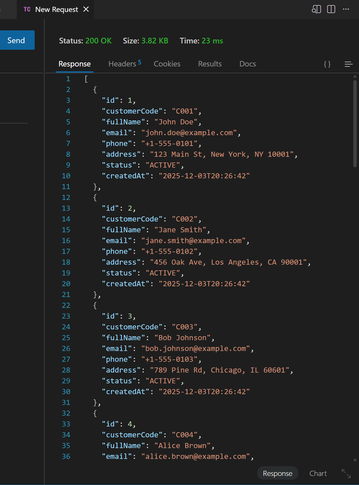
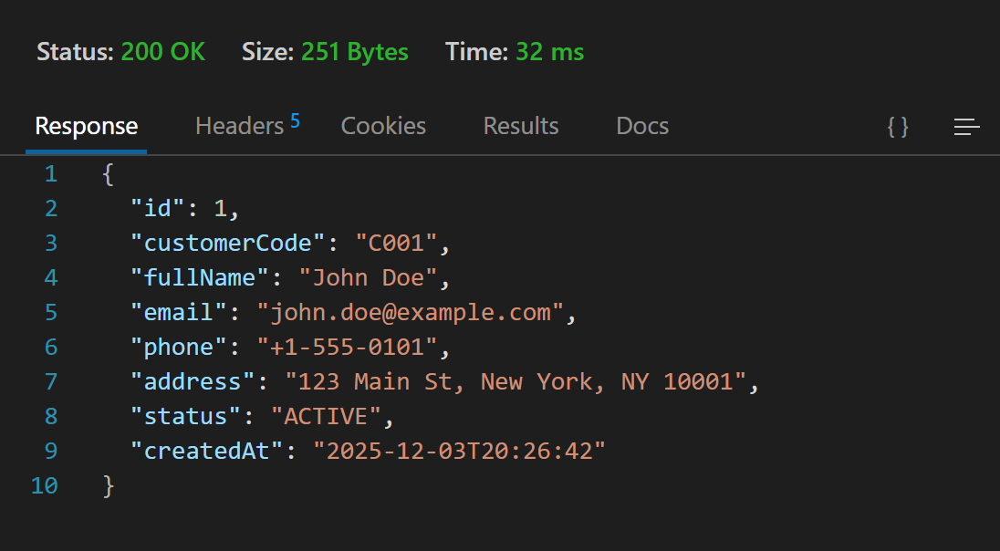
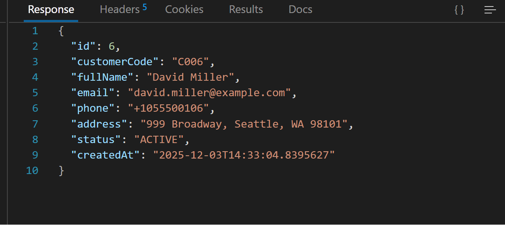
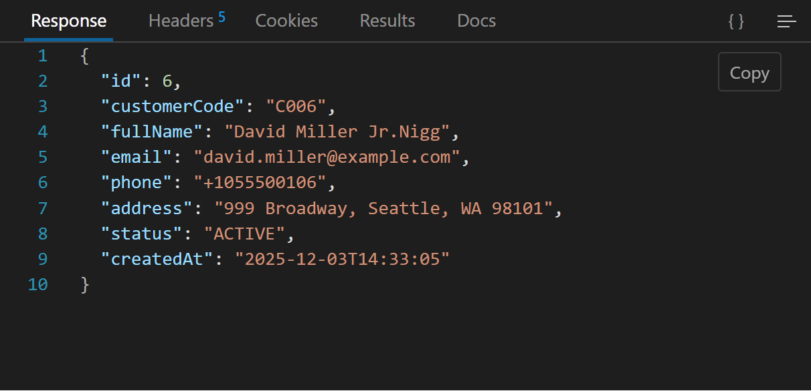
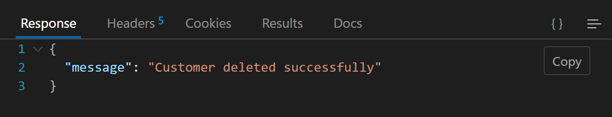
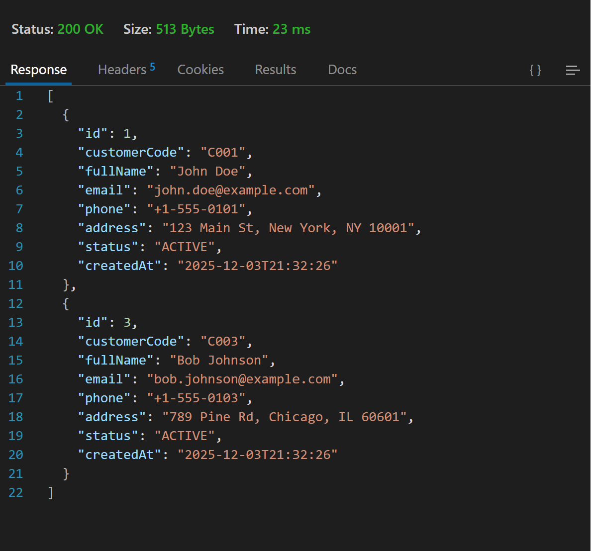
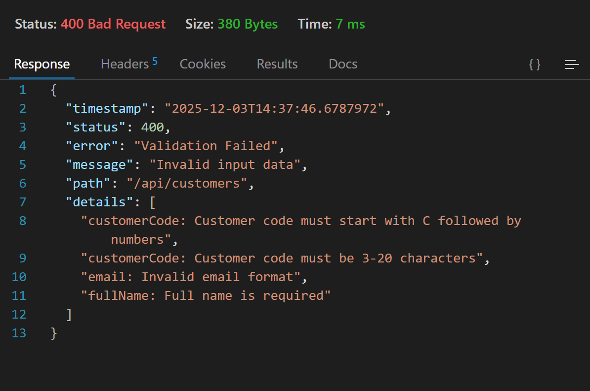
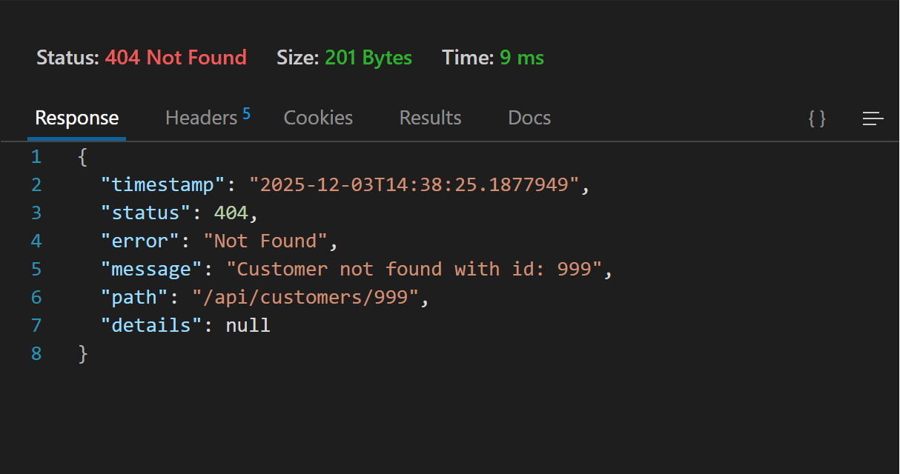
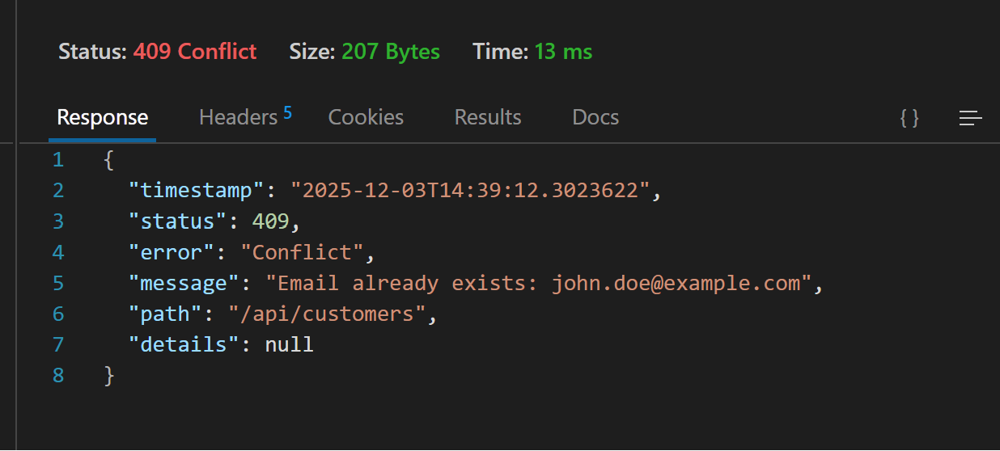

# Web-Application-Development-Lab-08
## LAB 08: REST API &amp; DTO PATTERN

### Test 1: GET All Customers
````
Method: GET
URL: http://localhost:8080/api/customers

Expected Response (200 OK):
[
    {
        "id": 1,
        "customerCode": "C001",
        "fullName": "John Doe",
        "email": "john.doe@example.com",
        "phone": "+1-555-0101",
        "address": "123 Main St, New York, NY 10001",
        "status": "ACTIVE",
        "createdAt": "2024-11-03T10:00:00"
    },
    ...
]
````


### Test 2: GET Customer by ID

````
Method: GET
URL: http://localhost:8080/api/customers/1

Expected Response (200 OK):
{
    "id": 1,
    "customerCode": "C001",
    "fullName": "John Doe",
    ...
}
````



### Test 3: POST Create New Customer
````
Method: POST
URL: http://localhost:8080/api/customers
Headers: Content-Type: application/json

Body (JSON):
{
    "customerCode": "C006",
    "fullName": "David Miller",
    "email": "david.miller@example.com",
    "phone": "+1-555-0106",
    "address": "999 Broadway, Seattle, WA 98101"
}

Expected Response (201 Created):
{
    "id": 6,
    "customerCode": "C006",
    "fullName": "David Miller",
    ...
}
````


### Test 4: PUT Update Customer
````
Method: PUT
URL: http://localhost:8080/api/customers/6
Headers: Content-Type: application/json

Body (JSON):
{
    "customerCode": "C006",
    "fullName": "David Miller Jr.",
    "email": "david.miller.jr@example.com",
    "phone": "+1-555-0107",
    "address": "1000 Broadway, Seattle, WA 98101"
}

Expected Response (200 OK):
{
    "id": 6,
    "customerCode": "C006",
    "fullName": "David Miller Jr.",
    ...
}
````


### Test 5: DELETE Customer
````
Method: DELETE
URL: http://localhost:8080/api/customers/6

Expected Response (200 OK):
{
    "message": "Customer deleted successfully"
}
````



### Test 6: Search Customers
````
Method: GET
URL: http://localhost:8080/api/customers/search?keyword=john

Expected Response (200 OK):
[
    {
        "id": 1,
        "customerCode": "C001",
        "fullName": "John Doe",
        ...
    },
    {
        "id": 3,
        "customerCode": "C003",
        "fullName": "Bob Johnson",
        ...
    }
]
````


### Test 7: Validation Error
````
Method: POST
URL: http://localhost:8080/api/customers
Headers: Content-Type: application/json

Body (Invalid - missing required fields):
{
    "customerCode": "C",
    "email": "invalid-email"
}

Expected Response (400 Bad Request):
{
    "timestamp": "2024-11-03T10:30:00",
    "status": 400,
    "error": "Validation Failed",
    "message": "Invalid input data",
    "path": "/api/customers",
    "details": [
        "customerCode: Customer code must be 3-20 characters",
        "fullName: Full name is required",
        "email: Invalid email format"
    ]
}
````


### Test 8: Resource Not Found
````
Method: GET
URL: http://localhost:8080/api/customers/999

Expected Response (404 Not Found):
{
    "timestamp": "2024-11-03T10:35:00",
    "status": 404,
    "error": "Not Found",
    "message": "Customer not found with id: 999",
    "path": "/api/customers/999"
}
````


### Test 9: Duplicate Resource
````
Method: POST
URL: http://localhost:8080/api/customers
Headers: Content-Type: application/json

Body (Duplicate email):
{
    "customerCode": "C007",
    "fullName": "Test User",
    "email": "john.doe@example.com"
}

Expected Response (409 Conflict):
{
    "timestamp": "2024-11-03T10:40:00",
    "status": 409,
    "error": "Conflict",
    "message": "Email already exists: john.doe@example.com",
    "path": "/api/customers"
}
````

